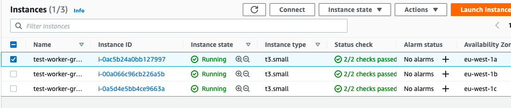

# test-eks

Разворачивание тестовог EKS кластера. 

> Для работы используется докер образ `dockervalexe/test-eks-tools:latest`. Также можно собрать собственный из dockerfile/Dockerfile

Порядок выполнения работ:

1. Запускаем из дирректории проекта докер, для дальнейшей работы:
  
        docker run --rm -it -w /src -v $(pwd)/src -v ~/.aws:/root/aws dockervalexe/test-eks-tools:latest

1. Создаем инфраструктуру (подразумевается, что креды для AWS уже переданы):
  
        terraform init && terraform apply

1. Создаем конфиг для кубернетис:
  
        aws eks --region eu-west-1 update-kubeconfig --name $(terraform output cluster_name)

1. Устанавливаем через helm pod для дальнейшего автоскейла:
  
        helm install --namespace kube-system stable/cluster-autoscaler --values=./cluster-autoscaler-chart-values.yaml --generate-name

1. Деплоим нашу тестовую ноду в 1 экземпляре:
  
        kubectl create deployment test --image=nginx --replicas=1

1. Получаем список рабочих pods:
  
        kubectl get pods
        

1. Деплоим 25 экземпляров:
   
        kubectl scale deployment/test --replicas 25

1. Видим, что часть подов не смогло задеплоиться:  
	
        # kubectl  get pods 
        NAME                    READY   STATUS    RESTARTS   AGE
        test-5f6778868d-44m47   0/1     Pending   0          52s
        test-5f6778868d-54c64   0/1     Pending   0          52s
        test-5f6778868d-5fcwq   0/1     Pending   0          52s
        test-5f6778868d-bkl8x   0/1     Pending   0          52s
        test-5f6778868d-bs8pg   1/1     Running   0          52s
        test-5f6778868d-c28bb   0/1     Pending   0          52s
        test-5f6778868d-c85kw   1/1     Running   0          52s
        test-5f6778868d-ck6qd   1/1     Running   0          52s
        test-5f6778868d-d2b2m   0/1     Pending   0          52s
        test-5f6778868d-dbd92   0/1     Pending   0          52s
        test-5f6778868d-gcg7k   0/1     Pending   0          52s
        test-5f6778868d-jg9gt   0/1     Pending   0          52s
        test-5f6778868d-lpt4r   1/1     Running   0          52s
        test-5f6778868d-m95zc   0/1     Pending   0          52s
        test-5f6778868d-mg6f4   0/1     Pending   0          52s
        test-5f6778868d-qmf27   0/1     Pending   0          52s
        test-5f6778868d-r667l   0/1     Pending   0          52s
        test-5f6778868d-rnswb   0/1     Pending   0          52s
        test-5f6778868d-rvv5q   1/1     Running   0          52s
        test-5f6778868d-s8pxt   1/1     Running   0          25m
        test-5f6778868d-tprwl   0/1     Pending   0          52s
        test-5f6778868d-twfvr   0/1     Pending   0          52s
        test-5f6778868d-wsl7c   0/1     Pending   0          52s
        test-5f6778868d-xj6ld   0/1     Pending   0          52s
        test-5f6778868d-xnd9k   0/1     Pending   0          52s
        
        # kubectl get nodes
        NAME                                     STATUS   ROLES    AGE   VERSION
        ip-10-0-0-6.eu-west-1.compute.internal   Ready    <none>   26m   v1.19.6-eks-49a6c0

1. Ждем 5 минут и видим, что список нод изменился и остальные поды (кроме одной, тк для нашего типа инстанса максимум 11 под, те всего 33 пода, а у нас получается 34 (9 системных и 25 мы запросили) ) смогли задеплоиться:

        # kubectl  get pods 
        NAME                    READY   STATUS    RESTARTS   AGE
        test-5f6778868d-44m47   0/1     Pending   0          2m54s
        test-5f6778868d-54c64   1/1     Running   0          2m54s
        test-5f6778868d-5fcwq   1/1     Running   0          2m54s
        test-5f6778868d-bkl8x   1/1     Running   0          2m54s
        test-5f6778868d-bs8pg   1/1     Running   0          2m54s
        test-5f6778868d-c28bb   1/1     Running   0          2m54s
        test-5f6778868d-c85kw   1/1     Running   0          2m54s
        test-5f6778868d-ck6qd   1/1     Running   0          2m54s
        test-5f6778868d-d2b2m   1/1     Running   0          2m54s
        test-5f6778868d-dbd92   1/1     Running   0          2m54s
        test-5f6778868d-gcg7k   1/1     Running   0          2m54s
        test-5f6778868d-jg9gt   1/1     Running   0          2m54s
        test-5f6778868d-lpt4r   1/1     Running   0          2m54s
        test-5f6778868d-m95zc   1/1     Running   0          2m54s
        test-5f6778868d-mg6f4   1/1     Running   0          2m54s
        test-5f6778868d-qmf27   1/1     Running   0          2m54s
        test-5f6778868d-r667l   1/1     Running   0          2m54s
        test-5f6778868d-rnswb   1/1     Running   0          2m54s
        test-5f6778868d-rvv5q   1/1     Running   0          2m54s
        test-5f6778868d-s8pxt   1/1     Running   0          27m
        test-5f6778868d-tprwl   1/1     Running   0          2m54s
        test-5f6778868d-twfvr   1/1     Running   0          2m54s
        test-5f6778868d-wsl7c   1/1     Running   0          2m54s
        test-5f6778868d-xj6ld   1/1     Running   0          2m54s
        test-5f6778868d-xnd9k   1/1     Running   0          2m54s
        
        # kubectl get nodes
        NAME                                      STATUS   ROLES    AGE   VERSION
        ip-10-0-0-51.eu-west-1.compute.internal   Ready    <none>   39s   v1.19.6-eks-49a6c0
        ip-10-0-0-6.eu-west-1.compute.internal    Ready    <none>   28m   v1.19.6-eks-49a6c0
        ip-10-0-0-94.eu-west-1.compute.internal   Ready    <none>   46s   v1.19.6-eks-49a6c0

1. Видим, что ноды создались в разных зонах региона:  

1. Уменьшаем количество реплик до 1:

        kubectl scale deployment/test --replicas 1

1. Через 20 минут видим, что количество нод, стало равным одному:

        # kubectl get nodes
        NAME                                     STATUS   ROLES    AGE   VERSION
        ip-10-0-0-6.eu-west-1.compute.internal   Ready    <none>   50m   v1.19.6-eks-49a6c0

1. Удаляем окружение: 

        terraform destroy
